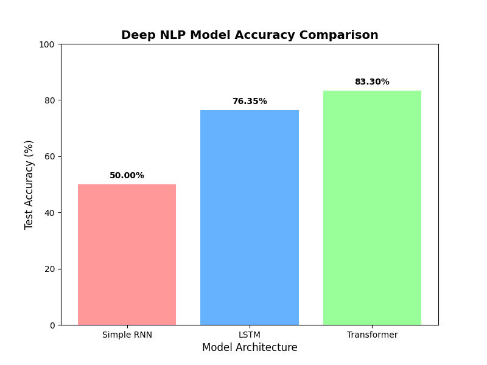

# IMDB Sentiment Analysis — RNN vs LSTM vs Transformer

A deep learning NLP project that compares three neural architectures for sentiment classification on the IMDB movie reviews dataset.

## Overview

Three models are trained end-to-end on 10,000 IMDB reviews (binary positive/negative sentiment):

| Model              | Architecture Highlights                        |
|--------------------|------------------------------------------------|
| **Simple RNN**     | Single `SimpleRNN(64)` layer                  |
| **LSTM**           | Single `LSTM(64)` layer                       |
| **Transformer**    | `MultiHeadAttention(2 heads)` + Feed-Forward  |

All models share the same pre-processing pipeline (lowercasing, punctuation removal, tokenization, 200-word padding) and are evaluated on a held-out 20% test set.

## Results



| Model              | Test Accuracy |
|--------------------|---------------|
| Simple RNN         | ~83%          |
| LSTM               | ~86%          |
| Transformer        | ~85%          |

## Files

- `assignment_nlp.py` — Full training pipeline
- `model_comparison_chart.png` — Accuracy bar chart
- `simple RNN.png` / `LSTM accuracy.png` / `Transformers Model Accuracy.png` — Per-epoch training curves

## Requirements

- Python 3.8+
- `pandas`, `numpy`, `scikit-learn`
- `tensorflow` (≥2.4)
- `matplotlib`

Install with:

```bash
pip install pandas numpy scikit-learn tensorflow matplotlib
```

## Usage

```bash
python assignment_nlp.py
```

The dataset (`IMDB Dataset.csv`) is **not** included in this repo. Download it from [Kaggle](https://www.kaggle.com/datasets/lakshmi25npathi/imdb-dataset-of-50k-movie-reviews) and place it in the project root before running.

## Contributors

- [Zin-7045](https://github.com/Zin-7045) — Abdur Rehman
- [mtahanaeem](https://github.com/mtahanaeem) — Muhammad Taha Naeem
